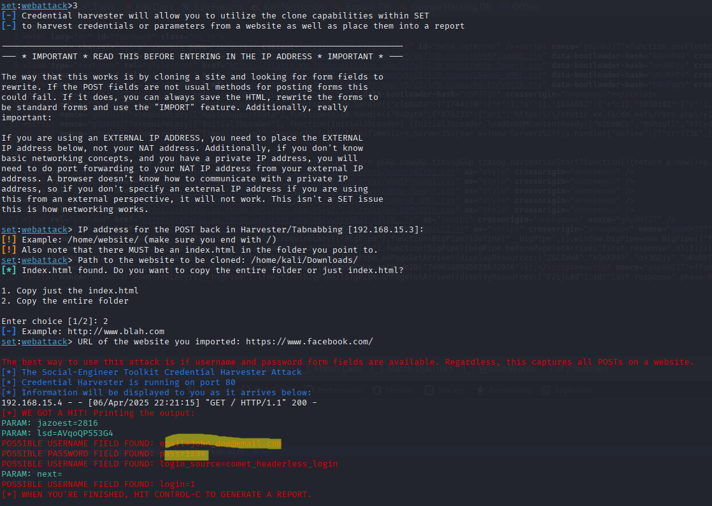

# Phishing para captura de senhas do Facebook

### Ferramentas

- Kali Linux
- setoolkit

### Configurando o Phishing no Kali Linux

- Acesso root: ``` sudo su ```
- Iniciando o setoolkit: ``` setoolkit ```
- Tipo de ataque: ``` Social-Engineering Attacks ```
- Vetor de ataque: ``` Web Site Attack Vectors ```
- Método de ataque: ```Credential Harvester Attack Method ```
- Método de ataque: ``` Site Cloner ```
- Obtendo o endereço da máquina: ``` ifconfig ```
- URL para clone: http://www.facebook.com

### Resutado de uma página do facebook sem defesa


### Resultado de uma página do facebook com defesa


- Isto ocorre porque sites como o facebook detectam o phishing primitivo que estamos tentando realizar

### Como burlar esta defesa inicial

Usaremos um Custom Import de modo a clonar o código fonte da página original.


### Primeira etapa

Entramos na página original do facebook e baixamos ela no nosso computador, aproveitamos para copiar o source code da página e guardar o id do botão de login

### Segunda etapa

Colamos o código fonte no html baixado e procuramos o id do botão no código. A linha de cima será o script que irá executar a ação do botão, nós removemos ela. Aproveitamos e trocamos o nome do html para index.html.


### Terceira etapa

Copiamos o path para a página do facebook e index.html


### Quarta etapa

Agora, seguimos o mesmo passo a passo original, mas optamos por Custom Import, colamos o caminho copiado, e selecionamos para copiar toda a folder.


### Quinta etapa

Agora, efetivamente, "pescamos" nosso alvo!


E quando o usuario tenta logar...

